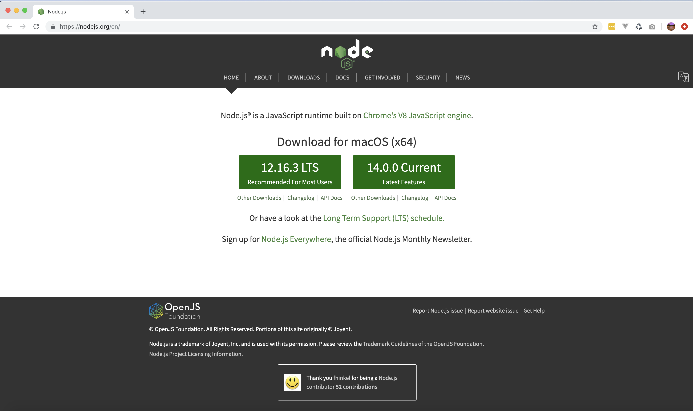
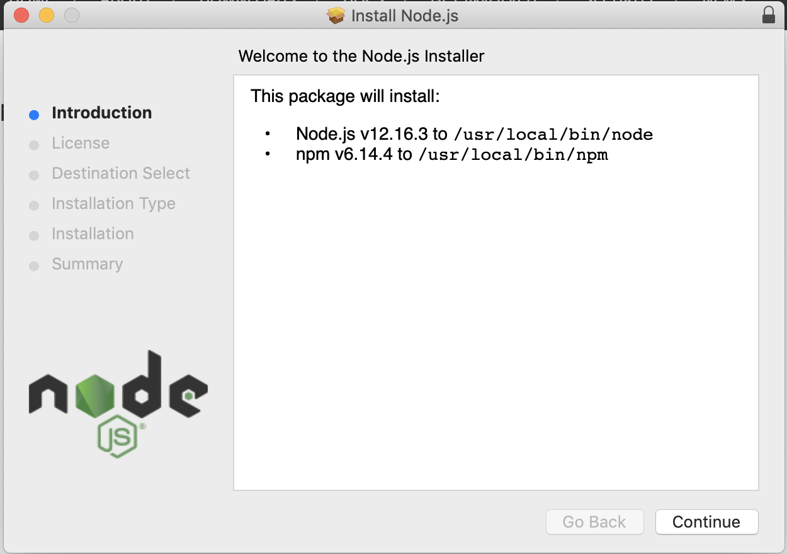
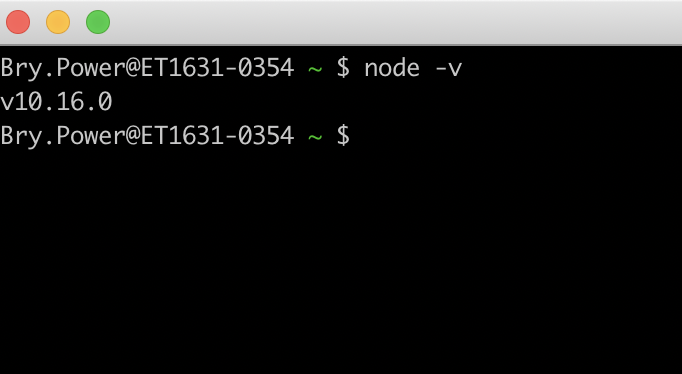
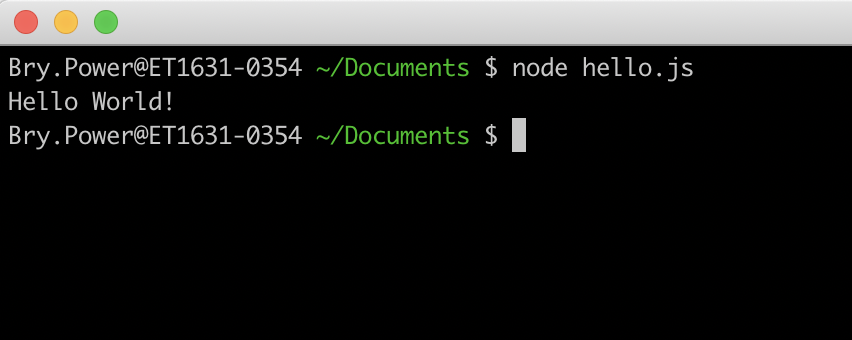
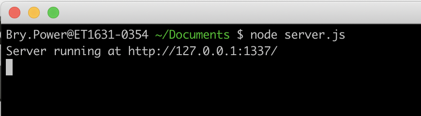
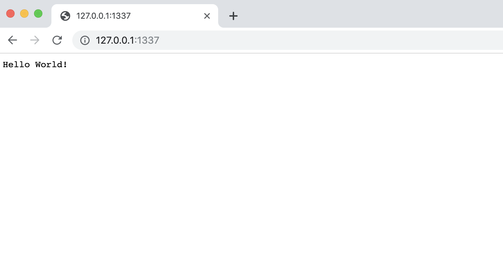
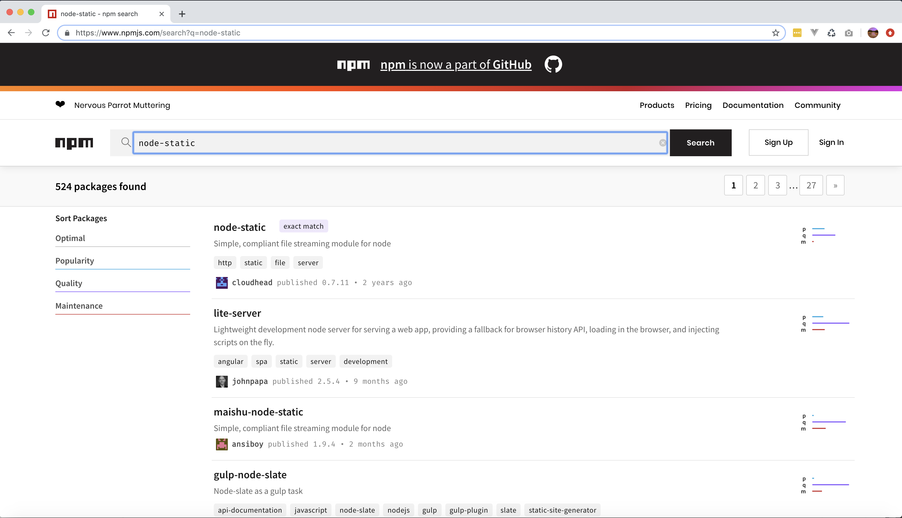
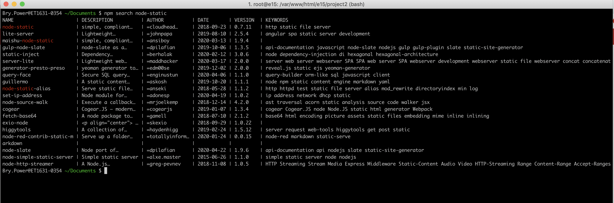

# Server side programming with Node.js as compared with traditional Server-side frameworks such as Laravel/PHP
+ By: Bry Power

## What is Node.js
Node.js is an open-source, JavaScript run-time environment used to execute JavaScript code on the server-side. Traditionally JavaScript was solely run on the client-side, but Node.js has changed that allowing both server and client-side code to be written in the same language.

JavaScript has traditionally been interpreted and executed by the browser’s engine using browser specific APIs such as the Document Object Model (DOM). A client-side JavaScript program has access to two types of objects - native objects (those provided by the JavaScript programming language) and host objects (those provided by the environment). When google made its browser's JavaScript engine (V8) open source, Node.js was developed on top of it by removing the host objects and adding new objects to allow new types of applications to be written, thus creating the Node.js environment. Native objects are available both in the browser and in Node.js, however the set of host object differ between the two.

## Introduction to Node.js
### Installing Node
Go to the [node installation page](https://nodejs.org/en/)



Once the package is downloaded open the installation wizard



Once installation in complete verify that it is installed by typing 'node -v' into the command line.



Once installed, you will see that a Node.js installation has two main parts: the main node executable and the npm executable. 

### Creating a Node.js Executable
The Node executable is simple to use. To make a simple Node program that prints 'Hello World!' to the console, simply create a file called hello.js with the following line of code:

```javascript
console.log("Hello World!");
```

To run a Node program usually you will pass only one argument, the name of your main Node.js source file. In this example: 
```
node hello.js
```
When run you should see the the output in the terminal:



### Starting the Node Server
To actually get a web server running, use the following example code: 

```javascript
var http = require('http'); 
http.createServer(function (req, res) { res.writeHead(200, {'Content-Type': 'text/plain'}); res.end('Hello World!\n'); 
    }).listen(1337, '127.0.0.1');
    console.log('Server running at http://127.0.0.1:1337/');
```

If you run this program, the command line will intentionally hang. The server must continue to run so it can wait for web page requests and respond to them. 



If you start a browser and type http://127.0.0.1:1337/ into the address bar, the browser will send a request to the node server and you will see a simple web page that says, “Hello world!” 



Notice the Node.js require() global function. The require() function makes a Node.js module available for use, similar to the PHP use statement, which makes classes in other namespaces available to use. Unlike namespaces in PHP, Node.js allows the user of the module to specify the name of the namespace because the user assigns the module to his variable.

### Node Package Manager (NPM)
In the above case the module being imported, http, is a native node module. Modules created with new functionality (not part of the core Node.js) are packages. A package is a module that can be added to the node executable later and is not built into the node executable by default. 

The npm (node package manager) executable adds new packages to the node executable. 

To install a package, first find the npm package that you want to install. Packages can be found on [the npm website](https://www.npmjs.com/):



Or using the search command in the npm executable:



This package can be installed by running the following command line:

```
npm install node-static
```

## Callbacks and Multi-threading
The biggest difference between JavaScript and PHP is that it is a sequential language, whereas JavaScript is an event-driven one. The reason for this comes down to the difference in the purpose for which each language was developed.

PHP was developed in 1994 as a replacement for CGI scripts. CGI scripts were C programs that executed when the browser requested a specific URL and were single-threaded and ran from beginning to end in a step-by-step fashion. Since PHP was a drop-in substitute for single-threaded C programs, PHP naturally adopted the single-threaded approach. PHP did not have any concept or the need for events, essentially the entire PHP script itself is one big handler, where the URL invocation the only event.

PHP pages were single-threaded because it was assumed that the web server would multi-thread them. Individual PHP pages would not benefit from threads, but if a web server was simultaneously serving multiple PHP pages, it could multithread its operations with them. PHP pages are the individual operations inside a web server that make a web application work, but they are not the web server itself. 

Javascript was developed in 1995 for a completely different purpose. Javascript was designed to run in the Netscape Navigator browser and was primarily designed to handle events. In the environment of an internet browser, users are expected to take actions that generate events such as clicking buttons and links, typing into forms, selecting items in select boxes, hovering the mouse over page elements. Javascript was designed to catch all the different kinds of events that might occur when a user interacts with a web page and associate a handler to run specific code with each event. 

While waiting for the user to click a certain button, an Internet browser cannot just hang and wait. In fact, when there are multiple controls on a web page, the order in which the controls might be manipulated and how they might be manipulated is totally unpredictable. This is completely different from PHP, where the number and order of events is completely predictable. 

Since it was designed for event handling, JavaScript had the concept of switching between tasks baked into its design from the very start: basically, doing something while waiting for something else to be done was the whole point. In JavaScript, event handlers could be set up for handling user interaction events or to handle completion events from long running operations. Many operations could be provided with an event handler, be triggered, and more code could be run. When the operation completed, the event handler would be invoked, even if other JavaScript code farther along was still being run. 

When Node.js was developed in 2009 it retained JavaScript's multi-threaded background. Rather than being modeled on a single-threaded, single-page server language like PHP, it is modeled on the web server itself. Each PHP page represents a single request, but each Node.js script represents an entire web server. 

Consider the following PHP code that creates a file, writes “Hello World!’ to the file and closes the file:

```php
<?php
    $fp = fopen('fp.txt', 'w');
    fwrite($fp, 'Hello world!');
    fclose($fp);
?>
```

The equivalent Node.js versions would look like this:

```javascript
var fs = require('fs');

fs.open('fp.txt', 'w', 0666, function(error, fp) { 
    fs.write(fp, 'Hello world!', null, 'utf-8', function() {
        fs.close(fp, function(error) {
        }); 
    });
});

```

There are many things here that are very similar but some things that are different. The major difference is that in Node.js, the fp variable is not the return value from the Node.js fs.open() API function; it is passed as an argument to the callback function, which is the last argument in the Node.js fs.open() API function call. 

PHP is composed of sequential, also known as blocking, APIs. Each statement is executed in order and the next statement does not start to execute until the statement before it is completed. When the PHP fopen() API function is called, its return value contains the file pointer because the PHP fopen() API function call does not return until the file is actually open.

Node.js is composed mostly of nonblocking APIs. Each statement is still executed in order, but a function passed as an argument to the call is invoked when the statement is completed. The next statement in order might execute before or after that happens. 

### Real-time web application development

A real-time web app is one where information is transmitted (almost) instantaneously between users and the server, and therefore, between users and other users. This is in contrast with traditional web apps where the client has to ask for information from the server.

In a traditional web app, the clients have no idea when the state of the server may have changed, so it either polls for changes every so often or just waits for the user to initiate the request.

But with a real-time app, the client opens up a connection directly to the server so either side can send a message to the other without waiting to be asked for it. If something on the server changes, it sends the data over the connection to the client. If something on the client changes, it sends it to the server and the server can decide whether other clients need to know about the change.

Due in large part to Node.js being event based and non-blocking, as well as the ability for streaming data transfer, Node.js supports real-time web application development – this allows for the development of applications that would not be possible with a traditional server side language. For example:

* Chat applications
* Betting or stock-brokering applications, where important data is always changing
* Online gaming
* Community storage solutions where data is always updated

## Server-side rendering
Traditionally web pages are rendered on the client-side. With a client-side rendering, you redirect the request to a single HTML file, the server processes the response via a server side language such as PHP and then delivers it to the browser, but nothing will be rendered for the user to see until all the JavaScript is fetched and the browser has compiled everything. Sometimes, especially if the user has a slow internet connection, or the JavaScript files being fetched and compiled are especially large, or the user is on an outdated device, this gap in time between the request being made and the page being rendered can be perceptible to the user.

This method also has consequences for single page applications, where the content is populated dynamically, and page is not reloaded after the initial request. In this case, using client-side rendering would mean that the page and content could not be indexed fully by a search engine. It also means that when a link to the page is shared via a social media platform such as Facebook, neither the title nor the thumbnail would render properly.

When using Node.js, you have the option to use server-side rendering. This is especially easy to implement with a Node.js framework such as Next.js, Nuxt.js, or Nest.js. With server-side rendering, the server’s response to the browser is the full HTML ready to be rendered so the browser can start rendering without having to wait for all the JavaScript to be downloaded and compiled. This means you can render your page on the server before it hits the browser, allowing users to see the page quicker. 


# Benefits of Node.js (over traditional Server-side frameworks such as Laravel/PHP)
* Support for multi-threading
* Built-in server support
* A single syntax for client and server side of the website
* Streaming data transfer 
* Supports real-time Web development 
* Server-side rendering
* Better at handling concurrent requests

## Drawbacks of Node.js (compared traditional Server-side frameworks such as Laravel/PHP)
* PHP, especially using a framework such as Laravel, is easier to learn and quicker to get up and running
* Laravel has a simple and elegant syntax and many useful out of the box tools
* PHP is better supported by web hosting services. If you develop a web application and want to give it to other people to run, they can install it almost anywhere if it is written in PHP 

## Outside Resources
* [Node.js Documentation](https://nodejs.org/api/)
* [Laravel vs Node.js](https://stackshare.io/stackups/laravel-vs-nodejs)
* [Why The Hell Would I Use Node.js? A Case-by-Case Tutorial](https://www.toptal.com/nodejs/why-the-hell-would-i-use-node-js)
* [PHP vs NodeJS comparison and benchmarks](https://thinkmobiles.com/blog/php-vs-nodejs/)
* [Single Page App Backends: Where Laravel Beats Node.js](https://vuejsdevelopers.com/2017/06/04/vue-js-backend-laravel-beats-node/)
* [Why Is Node.js Popular in Real Time Applications](https://www.freelancinggig.com/blog/2017/01/26/node-js-popular-real-time-applications/)
* [Client-side vs. Server-side vs. Pre-rendering for Web Apps](https://www.toptal.com/front-end/client-side-vs-server-side-pre-rendering)
* [What’s Server Side Rendering and do I need it?](https://medium.com/@baphemot/whats-server-side-rendering-and-do-i-need-it-cb42dc059b38)
* [Single-page application vs. multiple-page application](https://medium.com/@NeotericEU/single-page-application-vs-multiple-page-application-2591588efe58)